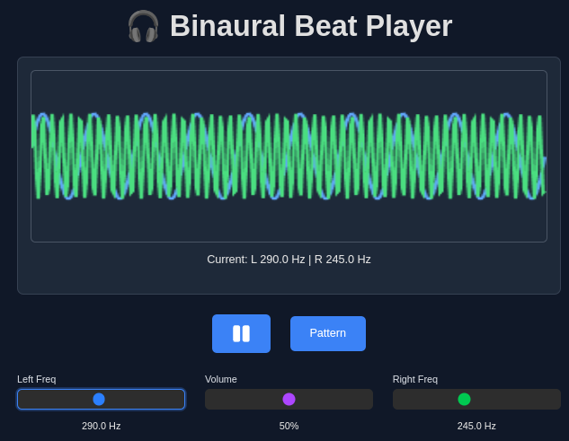

# Binaural Beat Player 🎧

A web application built with Next.js, React, and Bun runtime to generate and play binaural beats. Users can manually control frequencies, play predefined patterns, adjust volume, and visualize the audio waves.

<p align="center">
  
</p>
<p align="center">
  <em>Main interface of the Binaural Beat Player showing frequency controls and visualization.</em>
</p>
<p align="center">Go to 
  <a href="https://grigio.github.io/bineural-player/" target="_blank">🎧 Binaural Beat Player</a>
</p>

## ⚡ Bun Runtime

This project exclusively uses **[Bun](https://bun.sh/)** as the JavaScript runtime and package manager. Bun provides:

- **Faster installation times** compared to npm/yarn/pnpm
- **Reducuced bundle size** through optimized bundling
- **Built-in TypeScript support** without additional configuration
- **Improved runtime performance** for both development and production

**Prerequisites:** Install Bun before getting started:
```bash
curl -fsSL https://bun.sh/install | bash
```

## ✨ Features

*   **Manual Frequency Control:** Set specific frequencies (1-600 Hz) for the left and right audio channels using sliders.
*   **Pattern Mode:** Play sequences of binaural beats defined in a JSON format. Each step includes left frequency, right frequency, and duration.
*   **Volume Control:** Adjust the overall volume of the generated audio with frequency-aware scaling.
*   **Audio Visualization:** See a real-time representation of the left (blue) and right (green) audio waves on a canvas.
*   **Play/Pause Control:** Easily start and stop the audio playback with smooth transitions.
*   **Mode Switching:** Toggle between Manual and Pattern modes.
*   **Responsive Design:** Adapts to different screen sizes using Tailwind CSS.
*   **Icons:** Uses `react-icons` for UI elements like play/pause buttons.

## 🚀 Getting Started

1.  **Clone the repository (if you haven't already):**
    ```bash
    git clone https://github.com/grigio/binaural-beat-player.git
    cd binaural-beat-player
    ```
2.  **Install dependencies using Bun:**
    ```bash
    bun install
    ```
3.  **Run the development server:**
    ```bash
    bun run dev
    ```
4.  Open [http://localhost:3000](http://localhost:3000) in your browser to use the player.

## 🛠️ Technology Stack

*   **[Bun](https://bun.sh/)** - Fast JavaScript runtime and package manager
*   **[Next.js 14.2.15](https://nextjs.org/)** - React framework with App Router
*   **[React 18.3.1](https://reactjs.org/)** - JavaScript library for building user interfaces
*   **[TypeScript](https://www.typescriptlang.org/)** - Typed superset of JavaScript
*   **[Tailwind CSS v4](https://tailwindcss.com/)** - Utility-first CSS framework with @theme syntax
*   **[React Icons](https://react-icons.github.io/react-icons/)** - Library for including popular icons in React projects
*   **[Web Audio API](https://developer.mozilla.org/en-US/docs/Web/API/Web_Audio_API)** - Native browser API for generating and manipulating audio

## 📖 Pattern Format

Create custom binaural beat patterns using JSON format:

```json
{
  "pattern": [
    [left_frequency, right_frequency, duration_ms],
    [100, 90, 3000],
    [90, 100, 2500]
  ]
}
```

**Predefined patterns available:**
- `ai-gemini.json` - 30Hz binaural beats for AI focus
- `creative.json` - Creativity enhancement patterns
- `intro.json` - Introduction sequences
- `relaxing.json` - Relaxation frequencies
- `scala.json` - Musical tuning patterns

## 🔧 Audio Features

- **Frequency Range:** 1-600 Hz for both channels
- **Automatic Volume Scaling:** Volume adjusts based on average frequency (1Hz=100%, 600Hz=30%)
- **Smooth Transitions:** Linear ramping for frequency and volume changes
- **Stereo Separation:** True binaural experience with left/right channel isolation
- **Real-time Visualization:** Canvas-based waveform display

## 🚀 Build and Deploy

```bash
# Build for production (creates static export)
bun run build

# Start production server locally
bun run start

# Deploy to GitHub Pages
bun run deploy
```

The application automatically builds as a static site optimized for GitHub Pages deployment with proper asset prefix handling.

The application automatically builds as a static site optimized for GitHub Pages deployment.

## 🤝 Contributing

This project uses [Bun](https://bun.sh/) as its exclusive runtime and package manager. Please ensure you have Bun installed before contributing.

## 📄 License

This project is licensed under the MIT License.
